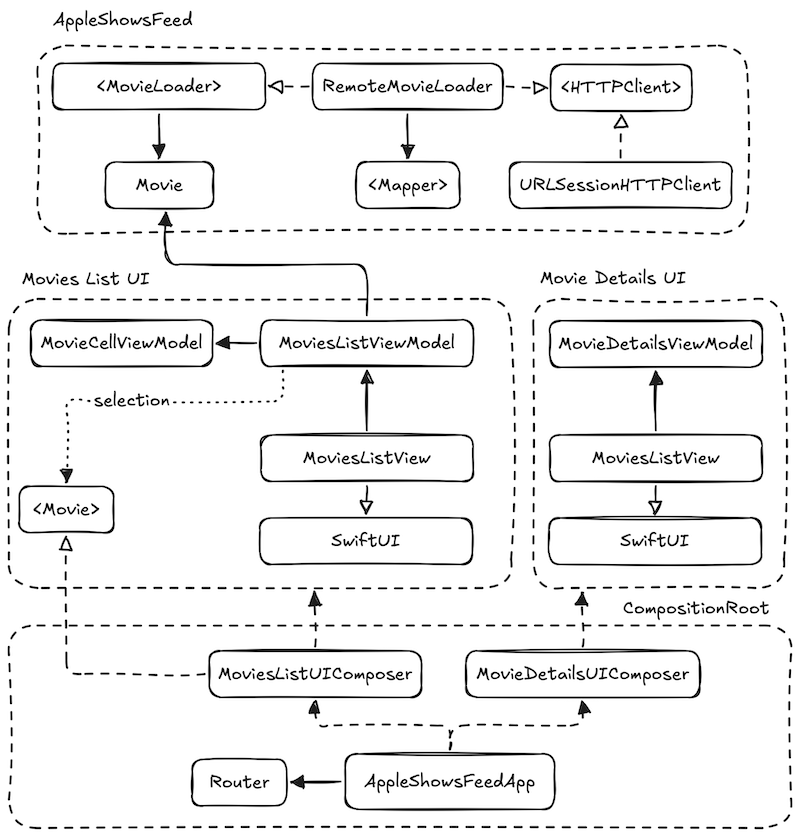

# ``AppleShowsFeed``

SwiftUI iOS client for the iTunes Store `topMovies` RSS feed `https://ax.itunes.apple.com/WebObjects/MZStoreServices.woa/ws/RSS/topMovies/json` built with SwiftUI and modern iOS development practices.

## 🎯 Overview

- Displays trending movies from the iTunes Store RSS JSON feed.
- Built with **SwiftUI + MVVM** and a lightweight **Clean Architecture** layer.
- Used the `JSON` RSS feed version instead of `XML`, since it integrates seamlessly with Swift’s `Decodable` protocol making it simpler and faster to parse. Also, providing type safety by default.
    - **Note:** However, I abstracted parsing into `MoviesMapper`, so if `XML` parsing is required in the future, we can introduce a `XMLMovieMapper` and inject it into `RemoteMovieLoader` without changing higher layers. Ensuring separation of concerns and extension.
- Modular Xcode schemes and testing targets.
- ⚠️ Demo-only country picker – hard-coded flags and two markets (CA / ES).

### 🏗️ Architecture

Basic clean architecture featuring SOLID principles. Ensuring the system is modular, testable and easy to extend.
MVVM design pattern for SwiftUI, defining clear separation between views and business logic.

### Project structure and schemes

This project is organized into multiple Xcode schemes to separate concerns and optimize both development speed and future CI/CD reliability.

| Scheme  | Purpose |
| ------------- |:-------------:|
| `AppleShowsFeed` (macOS)     | Business logic. Run fast unit tests with zero UI     |
| `AppleShowsFeedApp` (iOS)      | UI layer and composition root for the iOS app    |
| `CI_iOS`      | Aggregated plan for CI – executes every test target     |
| `MoviesAPIEndToEndTests`      | Manual scheme; validates real network contract     |

### Prerequisites

- Xcode 16.4+
- iOS 18.5+
- Swift 5.0+

### Installation

1. Clone the repository
2. Open `AppleShowsFeed.xcworkspace` in Xcode 
3. Build and run `AppleShowsFeedApp` scheme on iOS simulator.

## Roadmap

### Feature improvements
- [ ] In-app movie trailer player.
- [ ] Deep-link to iTunes Store page.
- [ ] Top TV Seasons & Episodes tabs.

### Technical improvements
- [ ] Local cache + image persistence.
- [ ] Localization
- [ ] Offline mode & reachability handling.
- [ ] CI/CD pipeline.

### 🤝 Contributing
This project serves as a portfolio piece, but suggestions and improvements are welcome. Please feel free to open issues or submit pull requests.

### 📞 Contact

Created by Oswaldo Maestra

Last Updated: September 2025

